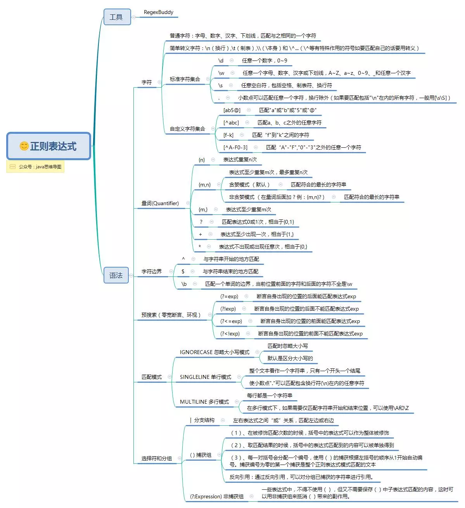

##### php example 

[github搜索技巧](github.md)  
[ThinkPHP](thinkphp.md)

###### 参考手册
```angular2html
1. Array
2. Calendar
3. cURL
4. Directory
5. Error
6. Filesystem
7. Filter
8. FTP
9. HTTP
10. LibXML
11. Mail
12. Math
13. Misc
14. MySQLi
15. SimpleXML
16. String
17. XML Parser
18. ZIP

```

###### 基础语法
```angular2html
1. 变量规则：
    - 必须以$符号开始
    - 变量名只能包含字母数字以及下划线
    - 区分大小写
2. 变量作用域：
    - local: 超级全局变量（PHP自带变量）
        $GLOBALS:
        $_SERVER: 包含了诸如头信息(header)、路径(path)、以及脚本位置(script locations)等等信息的数组
        $_REQUEST: 用于收集HTML表单提交的数据
        $_POST: 用于收集表单数据，form标签的指定该属性："method="post"
        $_GET: 用于收集表单数据，form标签的指定该属性："method="get"
        $_FILES: 
        $_ENV: 
        $_COOKIE: 
        $_SESSION: 
    - global
    - static 
    - parameter
3. echo 和 print
    echo - 可以输出一个或者多个字符串，没有返回值（效率更高）
    print - 只允许输出一个字符串，返回值为1
4. EOF: 在命令行shell中定义字符串
    echo <<<EOF
        ...
    EOF;
    // 结束需要独立一行且前后不能空格
5. 数据类型
    - String 
        strlen: 返回字符串的字符数
            echo strlen("中文字符");   // 输出 12
            echo mb_strlen("中文字符",'utf-8');  // 输出 4
            
    - Integer: 111(十进制) 0x1(十六进制) 01(八进制)
    - Float
    - Boolean
    - Array : array()创建数组
        排序：sort()
    - Object 
    - NULL
6. 常量
   bool define ( string $name , mixed $value [, bool $case_insensitive = false ] )
       name：必选参数，常量名称，即标志符。
       value：必选参数，常量的值。
       case_insensitive ：可选参数，如果设置为 TRUE，该常量则大小写不敏感。默认是大小写敏感的。
   预定义常量：
        __LINE__: 文件中的当前行号
        __FILE__: 文件的完整路径和文件名
        __DIR__: 文件所在的目录
        __FUNCTION__: 函数名称
        __CLASS__: 类的名称
        __TRAIT__: 实现了代码复用的一个方法，称为 traits
        __METHOD__: 类的方法名
        __NAMESPACE__: 命名空间的名称
7. 命名空间: namespace
8. 面向对象
    构造函数：__construct 
    析构函数：__destruct 
```

###### 表单
```angular2html

    
```

###### 进阶
```angular2html
1. 日期函数：date()
2. include和require的区别 ：处理错误的方式不同，include会生成一个警告warning继续执行，而require会生成error脚本停止执行
3. 文件处理：
    文件操作
    文件上传和下载
4. cookie: 
    创建：setcookie(name,value,path,domain) 
    获取：$_COOKIE["name"]
    删除：// 设置 cookie 过期时间为过去 1 小时 setcookie(name, "", time()-3600);
5. session: 
    创建：session_start(),
    赋值：$_SESSION['views']=value
    销毁：unset() 或 session_destroy()：失去所有已存储的 session
6. STMP: email
7. 错误和异常处理: 
8. 过滤器：对外部数据进行过滤处理
    - 来自表单的数据
    - Cookies
    - Web services data 
    - 服务器变量
    - 数据库查询结果
9. JSON和XML处理
```

###### PHP7新特性
```angular2html

```

###### 小示例
- [留言板](phpexample.cn/demo1)
- [上传文件](phpexample.cn/demo2)
- [UEditor文本编辑器](phpexample.cn/demo3)
- [自定义分页模板 AND 日历](phpexample.cn/demo4)

###### ThinkPHP学习
```angular2html
1. 基础：
    - 安装：composer/git/download zip
    - 目录机构：
        ├─application           应用目录
        │  ├─common             公共模块目录（可以更改）
        │  ├─module_name        模块目录
        │  │  ├─config.php      模块配置文件
        │  │  ├─common.php      模块函数文件
        │  │  ├─controller      控制器目录
        │  │  ├─model           模型目录
        │  │  ├─view            视图目录
        │  │  └─ ...            更多类库目录
        │  │
        │  ├─command.php        命令行工具配置文件
        │  ├─common.php         公共函数文件
        │  ├─config.php         公共配置文件
        │  ├─route.php          路由配置文件
        │  ├─tags.php           应用行为扩展定义文件
        │  └─database.php       数据库配置文件
        │
        ├─public                WEB目录（对外访问目录）
        │  ├─index.php          入口文件
        │  ├─router.php         快速测试文件
        │  └─.htaccess          用于apache的重写
        │
        ├─thinkphp              框架系统目录
        │  ├─lang               语言文件目录
        │  ├─library            框架类库目录
        │  │  ├─think           Think类库包目录
        │  │  └─traits          系统Trait目录
        │  │
        │  ├─tpl                系统模板目录
        │  ├─base.php           基础定义文件
        │  ├─console.php        控制台入口文件
        │  ├─convention.php     框架惯例配置文件
        │  ├─helper.php         助手函数文件
        │  ├─phpunit.xml        phpunit配置文件
        │  └─start.php          框架入口文件
        │
        ├─extend                扩展类库目录
        ├─runtime               应用的运行时目录（可写，可定制）
        ├─vendor                第三方类库目录（Composer依赖库）
        ├─build.php             自动生成定义文件（参考）
        ├─composer.json         composer 定义文件
        ├─LICENSE.txt           授权说明文件
        ├─README.md             README 文件
        ├─think                 命令行入口文件
    3. 运行环境：
        5.0.* ： php5.4+
        5.1.* :  php5.6+
        PDO extension ,mb_string extension,cURL extension
    4. controller/model/view
    5. config.php [配置文件说明](/application/config.php)
2. 路由
3. Request和Response: 
4. Db类：
    - 原生查询：Db::execute(sql)
    - 构造器查询：Db::table(table)->...->...  链式操作
    - 事务支持：Db::transaction(function(){
        Db::table(table1);
        Db::table(table2);
        ...
    })
    - 构建器查询：Db::name('name')->...->... 
        与构造器查询的区别：
            - 去除数据表前缀tp_
            - 支持视图查询
            - 支持闭包查询
            - 支持聚合查询
            - 支持时间查询
            - 支持字符串查询
            - 支持分块查询：1万条记录分成100次处理，每次处理100条记录
5. controller
6. model:
    - 基础操作
    - 读取器和修改器：控制数据库字段的插入和读取
    - Validate：输入和验证
    - 关联：多表查询
7. view
    - 模板输出：fetch和display
    - 公共模板和布局模板：
        {include file="user/header" /}
         {__CONTENT__}
        {include file="user/footer" /}
    - 标签定制
    - 
8. 调试和日志
9. API开发
10. 命令行工具
11. 扩展
    - 函数扩展：重写application或者各个module下的common.php文件，定义公共函数
    - 类库扩展：第三方类库遵循PSR-4自动加载规范，则可放入extend目录，直接可以通过命名空间调用
    - 驱动扩展：
    - Composer扩展：类似java的maven和gradle
12. 杂项
    - Session
    - Cookie
    - 验证码：composer require topthink/think-captcha=1.*(2.*)
    - 文件上传
    - 图像处理：composer require topthink/think-image
    - 单元测试：PHPUnit、Phake或者SimpleTest
13. 助手函数
    - import：导入所需的类库 同java的Import 本函数有缓存功能
    - vendor：导入vendor目录下的第三方类库（非命名空间）
    - model/controller/view
    - db：
    - input：获取输入数据 支持默认值和过滤
    - request：获取当前的请求对象实例（单例）
    - response: 创建响应对象实例
    - session/cookie/cache/config
    - dump/halt/trace/exception/debug
    - json/xml/jsonp
    - success/abort/error
    - url：生成URL地址（支持路由反解）
    - lang：获取语言变量值
    - token：生成表单令牌（form表单项）
        <form action="" >
        <input type="text" name="name" />
        {:token('__hash__')}
        <input type="submit" />
        </form>
    
```

###### 路由指南
```html

```

###### Nginx和Apache的优缺点
```html
- Nginx:
    - 轻量级，占用更少的内存和资源
    - 抗并发，nginx处理请求是异步非阻塞的，而apache是阻塞型的，在高并发下nginx能保持低资源低消耗高性能
    - 高度模块化设计，编写模块相对简单
    - 社区活跃
- Apache：
    - rewrite比nginx强大
    - 模块超多，基本找到的都可以找到
    - 比较稳定，bug少
```

###### 正则表达式
